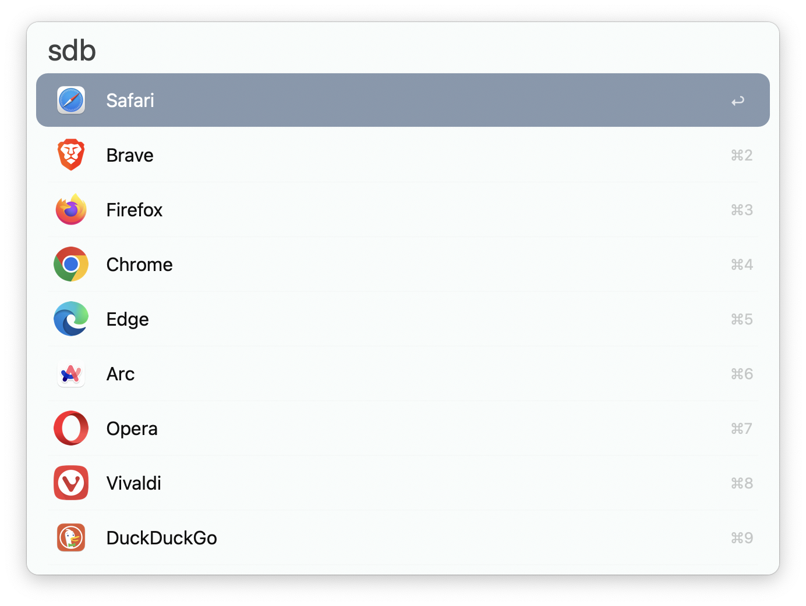
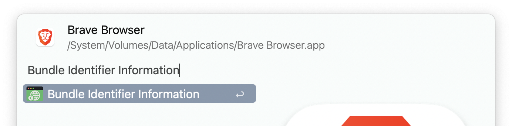
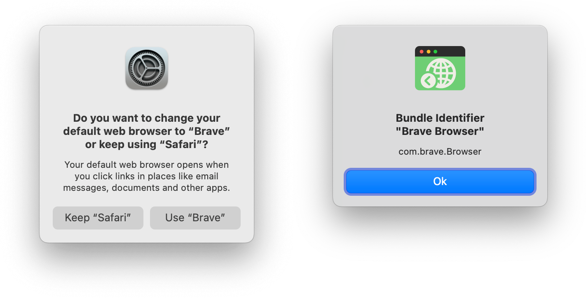

<h1 align="center">
    </br>
    Default Browser</br>
    <a href="https://github.com/zeitlings/alfred-set-default-browser/releases"></a>
</h1>

An [Alfred](https://www.alfredapp.com/) workflow to set the default web browser. 

## Usage Note

- Set the default web browser using the keyword (default: `sdb`).
- The macOS browser change confirmation dialog is automatically accepted.

**Utility**: Use the workflow's [File Action](https://www.alfredapp.com/help/workflows/triggers/file-action/) (name: `Bundle Identifier Information`) to retrieve an application's bundle identifier.

Add the browsers you're missing to the list filter and provide the bundle identifiers for them, or remove the ones that you don't need. Instead of adding the bundle identifier for, say, Brave Browser (`com.brave.Browser`), just providing the name (Brave) should also work. 





---

## Compiled Version (command line)

<details>

  <summary>See Details</summary>


The executable can be used to change the default browser from the command line: `./set_default_browser tor`


### Recompile

In your terminal:

```
mkdir set-default-browser
cd set-default-browser
swift package init --type executable
```

This will generate the following structure for you:  
```
.
├── Package.swift
├── README.md
├── Sources
│   └── set_default_browser
│       └── set_default_browser.swift
└── Tests
    └── set_default_browserTests
        └── set_default_browserTests.swift
```

Replace the contents of `set_default_browser.swift` with [the contents of the included main.swift](https://github.com/zeitlings/alfred-set-default-browser/blob/main/main.swift).  
Replace the contents of `Package.swift` with [the contents of the included Package.swift](https://github.com/zeitlings/alfred-set-default-browser/blob/main/Package.swift)

In your terminal, run:

```
swift build -c release
```

The executable is located in `.build/release/` (hidden folder) and is called `set_default_browser`. `release` is a symbolic link and, in my case, the path reads: `/.build/arm64-apple-macosx/release/set_default_browser`. Depending on your system, this might differ.

Copy the executable and replace the version that comes with the workflow.

 __Some Popular Browsers__
 
```
 Name			| Bundle Identifier
--------------------------------------------
Safari			| com.apple.Safari
Google Chrome		| com.google.Chrome
Firefox			| org.mozilla.firefox
Opera			| com.operasoftware.Opera
Brave Browser		| com.brave.Browser
Tor Browser		| org.torproject.torbrowser
Microsoft Edge		| com.microsoft.edgemac
Vivaldi			| com.vivaldi.Vivaldi
```


</details>


## Credit

- [J. W. Bargsten](https://bargsten.org/wissen/publish-swift-app-via-homebrew/#lab-section-1)
